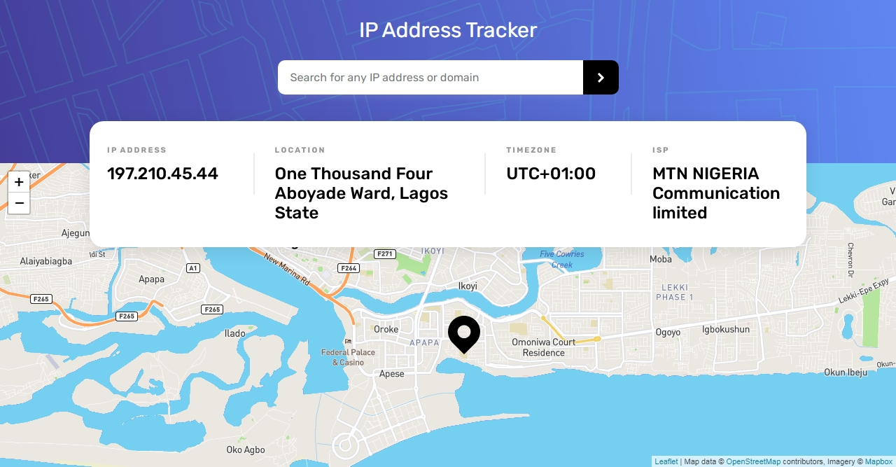

# Frontend Mentor - IP address tracker solution

This is a solution to the [IP address tracker challenge on Frontend Mentor](https://www.frontendmentor.io/challenges/ip-address-tracker-I8-0yYAH0). Frontend Mentor challenges help you improve your coding skills by building realistic projects.

## Table of contents

- [Overview](#overview)
  - [The challenge](#the-challenge)
  - [Screenshot](#screenshot)
  - [Links](#links)
- [My process](#my-process)
  - [Built with](#built-with)
  - [What I learned](#what-i-learned)
  - [Useful resources](#useful-resources)
- [Author](#author)

## Overview

### The challenge

Users should be able to:

- View the optimal layout for each page depending on their device's screen size
- See hover states for all interactive elements on the page
- See their own IP address on the map on the initial page load
- Search for any IP addresses or domains and see the key information and location

### Screenshot



### Links

- Solution URL: [Add solution URL here](https://your-solution-url.com)
- Live Site URL: [Add live site URL here](https://your-live-site-url.com)

## My process

### Built with

- Semantic HTML5 markup
- CSS
- Flexbox
- [Leaftlet](https://leafletjs.com/) - JS library
- [IP Geolocation API](https://geo.ipify.org/) - Geolocation API

### What I learned Doing This Project

- how to fetch data from an api using asyn/await.
- display users current location with the Leaflet S library
- how to check if the enter key is pressed when data is inputted

```js
function activateEnterKey(e) {
  e.preventDefault();
  if (!input === '') {
    if (e.type === 'keypress') {
      if (e.which == 13 || e.keyCode === 13) {
        // to make sure the enter key is pressed
        input.blur(); // on pressing enter, the cursor should dispear
        getUserIp(); // to invoke the getUserIp function
      }
    }
  }
}
```

- get the user IP on the page load
- adding a loader when fetching data

### Useful resources

- [Leaflet Documentaiton](https://www.example.com) - This helped me for to get the user location on load, and also dislay my map.

## Author

- Frontend Mentor - [@yourusername](https://www.frontendmentor.io/profile/yourusername)
- Twitter - [@williams-codes](https://www.twitter.com/williamscodes)
